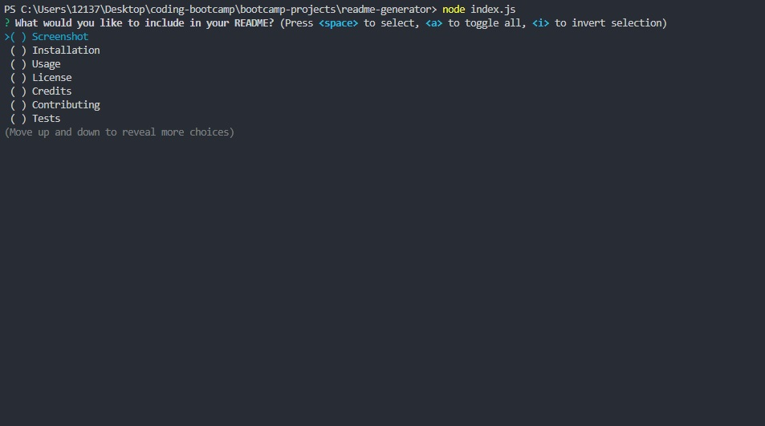

  
  

---

  # Professional Readme.md Generator

## Description



This is a command-line application that dynamically generates a professional README.md file from a user's input using the Inquirer package. The application will be invoked with the following command:

```bash
node index.js
```

---

## Table of Contents

- [Installation](#installation)
- [Usage](#usage)
- [Credits](#credits)
- [License](#license)
- [Contributing](#contributing)
- [Tests](#tests)
- [Questions](#questions)

---

## Installation

To install necessary dependencies (inquirer package, etc), run the following command:

```bash
npm i
```

---

## Usage

This application is used to generate a professional README.md file for a new project. After installation, run the following command:

```bash
node index.js
```

And you will be prompted with a series of questions. Answer the questions and a README.md file will be generated in the folder. README.md file will contain what user has chosen/entered for each question.

Here's a walkthrough video that demonstrates the functionality of the application:

https://drive.google.com/file/d/150ZkzFjQf0quPiEx75Pc0muP_r-ZmYv_/view?usp=sharing

---

## License

This project is licensed under the MIT license. Please see LICENSE.md for more information.

---

## Credits

Special thanks to UCB Coding Boot Camp for providing the starter code and the Inquirer package.

---

## Contributing

For contributions, please create a new branch of the project and submit a pull request. Any contributions are greatly appreciated. Issues can be submitted in the issues section of the repo or by emailing me directly (see Questions section below).

---

## Tests

Test feature is not available at this time.

However, you will be able to test the application in the near future by running the following command:

```bash
npm run test
```

---

## Questions

If you have any questions about the repo, open an issue or contact me directly at:

Github: [jyoungjoon](https://github.com/jyoungjoon)

Email: lifescriptified@gmail.com

---
