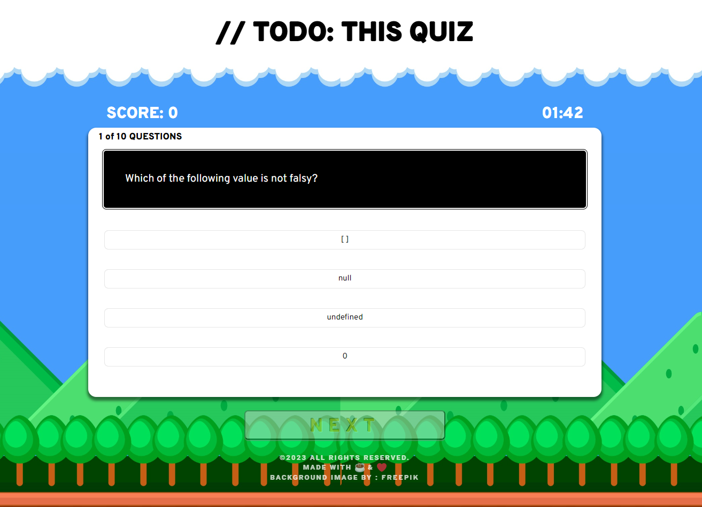

  
  

---

  # Javascript Quiz App

## Description



``` JavaScript Quiz App is a timed quiz app with a total of 10 questions.  ```


---

## Table of Contents

- [Installation](#installation)
- [Usage](#usage)
- [Credits](#credits)
- [License](#license)
- [Contributing](#contributing)
- [Tests](#tests)
- [Questions](#questions)

---

## Installation

You can simply download/clone the app from its repo to install.

---

## Usage

After installation, you can open index.html on your browser to start using.

---

## License
    This project is licensed under the MIT license.

---

## Credits

Michael, Jessica, Dahn

---

## Contributing

Please email me for contributing instructions.

---

## Tests

To test the app, you can open index.html on your browser.

---

## Questions

Please email me or find me on Github for any questions or issues.

Find me on Github: [jyoungjoon](https://github.com/jyoungjoon)

You can also contact me at lifescriptified@gmail.com.

---

